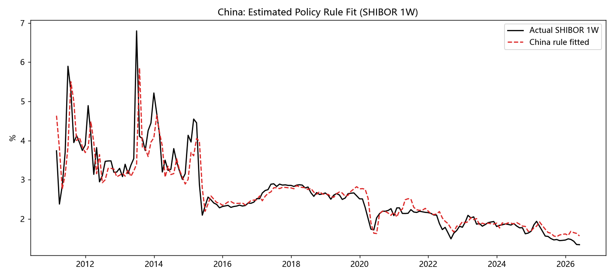

# 中美利率决定机制差异：量化研究 | China–US Interest-Rate Determination: A Quantitative Study

<p align="center">
  <a href="#中文"></a>
  &nbsp;
  <a href="#english"></a>
</p>

<p align="center">
  
  
  
  
</p>

---

## 中文

### 一句话结论

> **美国** = 单锚（2% 通胀）· 强规则（Taylor φ_π ≈ 1.51 > 1）· 快传导（政策→2Y 即期 0.39）· 强全球套利约束。
> **中国** = 多目标 · 弱价格规则（φ_π ≈ 0.30 < 1，R² 0.76 vs 美 0.99）· 价格–数量双轨 · 慢传导（SHIBOR→10Y 即期 0.03）· 强自主性（中美 10Y 相关 −0.18、不协整，利差 −2.72%）。

### 快速导航

| 想看什么 | 跳转 |
|---|---|
| 研究摘要 | [研究摘要](#研究摘要) |
| 方法框架 | [方法框架](#方法框架) |
| 主要图表 | [主要图表](#主要图表) |
| 快速复现 | [快速复现](#快速复现) |
| 编译论文 | [编译论文](#编译论文) |

---

### 研究摘要

> 中美两国同为大型经济体，利率水平对全球资本流动和资产定价举足轻重。然而，两国利率的决定机制是否存在系统性差异？差异体现在哪些维度、根源何在？

本项目从计量经济学角度，沿**四个维度**对中美利率决定机制进行系统性对比：政策反应函数（泰勒规则）、利率传导效率（ECM）、收益率曲线结构（PCA + 期限利差）、以及跨国联动与自主性（协整 + Granger 因果 + SVAR 脉冲响应）。全部实证结果均可一键复现。

### 方法框架

| 模块 | 方法 | 检验的差异维度 |
|---|---|---|
| 反应函数 | 含平滑的 Taylor Rule OLS + HAC | 政策锚与规则强度 |
| 利率传导 | 两步 Engle–Granger ECM + 协整 | 传导速度与充分性 |
| 曲线结构 | PCA 三因子 + 热力图 + 期限利差 | 曲线形态与驱动因子 |
| 波动特征 | 水平/差分标准差、滚动相关性 | "哪段利率最稳/最活" |
| 动态分析 | SVAR 脉冲响应 + 滚动 Taylor 参数 | 冲击传导的时变特征 |
| 跨国联动 | 协整 + Granger 因果 + 交叉相关 | 套利约束与自主性 |

### 主要图表

<p align="center">
  
  &nbsp;
  
</p>

<p align="center">
  
  &nbsp;
  
</p>

### 快速复现

```bash
# 1. 安装依赖
pip install -r code/requirements.txt

# 2. 抓取数据（FRED 无需 key；akshare 公开接口）
python code/data_fetch.py

# 3. （可选）Tushare Pro 补充数据：美债曲线/SHIBOR/LPR/CPI/PPI/M2
export TS_TOKEN=<your_tushare_token>   # 或写入 code/ts_token.txt
python code/tushare_fetch.py

# 4. 运行全部分析
python code/analysis.py       # 泰勒规则 / ECM / 协整 / 波动
python code/analysis2.py      # 曲线 / PCA / M2 / 实际利率 / Granger
python code/analysis3.py      # SVAR / 滚动参数 / 领先滞后 / 子样本
```

### 编译论文

```bash
# 需 TeX Live（xelatex + ctex）
cd report
latexmk -xelatex paper.tex    # 推荐：自动处理多次编译
# 或手动：xelatex paper.tex && xelatex paper.tex
```

产物为 `report/paper.pdf`，约 50 页标准学术论文（摘要 / JEL 分类 / 文献综述 / 制度背景 / 理论假说 / 实证分析 / 动态分析 / 机制成因 / 资产配置 / 稳健性 / 结论 / 35+ 参考文献 / 附录）。

### 目录结构

```
.
├── report/
│   ├── paper.tex          # 学术论文 LaTeX 源文件
│   └── paper.pdf          # 编译产物（约 50 页，23 张图）
├── code/
│   ├── data_fetch.py      # FRED + akshare → data/*.csv
│   ├── tushare_fetch.py   # Tushare Pro 补充数据
│   ├── analysis.py        # 泰勒规则 / ECM / 协整 / 波动
│   ├── analysis2.py       # 曲线 / PCA / M2 / 实际利率 / Granger
│   ├── analysis3.py       # SVAR / 滚动参数 / 领先滞后 / 子样本
│   └── requirements.txt
├── data/                  # 原始与对齐后的月度面板（CSV）
├── figures/               # 23 张图表（PNG）
└── LICENSE                # MIT
```

### 数据来源

- **美国**：FRED（FEDFUNDS、DGS2/10、PCEPILFE、UNRATE 等），公共 CSV 端点，无需 API key。
- **中国**：akshare（中债国债收益率、SHIBOR、LPR、CPI、GDP，源自中债登 / 同业拆借中心 / 统计局）；Tushare Pro 补充。

### 免责声明

本仓库为学术研究和竞赛用途，不构成任何投资建议。数据来自公开来源，口径与样本以代码输出为准。

---

## English

### TL;DR

> **US** = single anchor (2% inflation) · strong Taylor rule (φ_π ≈ 1.51 > 1) · fast pass-through (policy → 2Y spot: 0.39) · tight global arbitrage constraint.
> **China** = multi-objective · weak price rule (φ_π ≈ 0.30 < 1, R² 0.76 vs US 0.99) · price–quantity dual track · slow pass-through (SHIBOR → 10Y spot: 0.03) · strong autonomy (CN–US 10Y corr −0.18, no cointegration, spread −2.72%).

### Research Summary

> Both the US and China are major economies whose interest rates profoundly shape global capital flows and asset pricing. Yet are their rate-determination mechanisms systematically different? Along which dimensions, and why?

This project provides a systematic econometric comparison across **four dimensions**: policy reaction functions (Taylor rule), interest-rate transmission efficiency (ECM), yield-curve structure (PCA + term spreads), and cross-country linkages (cointegration + Granger causality + SVAR impulse responses). All empirical results are **fully reproducible** with a single command pipeline.

### Methods at a Glance

| Module | Method | What it tests |
|---|---|---|
| Reaction function | Taylor Rule OLS + HAC (with smoothing) | Policy anchor & rule strength |
| Rate transmission | Two-step Engle–Granger ECM + cointegration | Pass-through speed & completeness |
| Curve structure | PCA 3-factor + heatmap + term spread | Curve shape & driving factors |
| Volatility | Level / difference std, rolling correlation | "Which rate segment is most stable/active" |
| Dynamics | SVAR impulse response + rolling Taylor params | Time-varying shock propagation |
| Cross-country | Cointegration + Granger + cross-correlation | Arbitrage constraint & autonomy |

### Quick Reproduce

```bash
pip install -r code/requirements.txt
python code/data_fetch.py            # FRED + akshare (no API key needed)
python code/tushare_fetch.py         # optional: Tushare Pro supplementary data
python code/analysis.py              # Taylor rule / ECM / cointegration / volatility
python code/analysis2.py             # yield curve / PCA / M2 / real rates / Granger
python code/analysis3.py             # SVAR / rolling params / lead-lag / sub-sample
```

### Build the Paper

Requires TeX Live with `xelatex` + `ctex`:

```bash
cd report && latexmk -xelatex paper.tex
```

Output: `report/paper.pdf` (~50-page academic paper with abstract, JEL codes, literature review, institutional background, hypotheses, empirical analysis, dynamic analysis, mechanism discussion, asset allocation implications, robustness checks, conclusion, 35+ references, and appendix).

### Data Sources

- **US**: FRED (FEDFUNDS, DGS2/10, PCEPILFE, UNRATE, etc.) — public CSV endpoints, no API key required.
- **China**: akshare (CDB treasury yields, SHIBOR, LPR, CPI, GDP from CCDC / NIFC / NBS); Tushare Pro supplementary.

### Disclaimer

This repository is for academic research and competition purposes only. It does not constitute investment advice. Data are from public sources; definitions and sample coverage follow the code output.

---

<p align="center">
  
  
</p>
