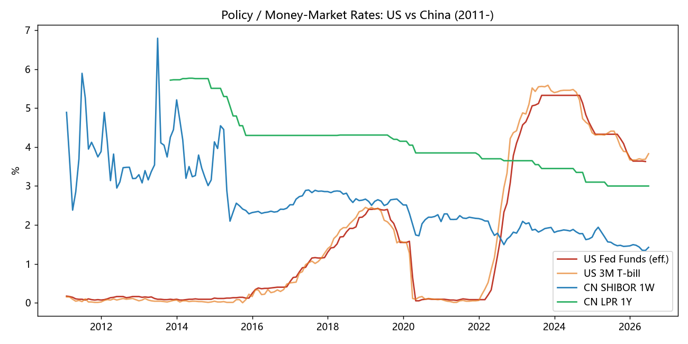
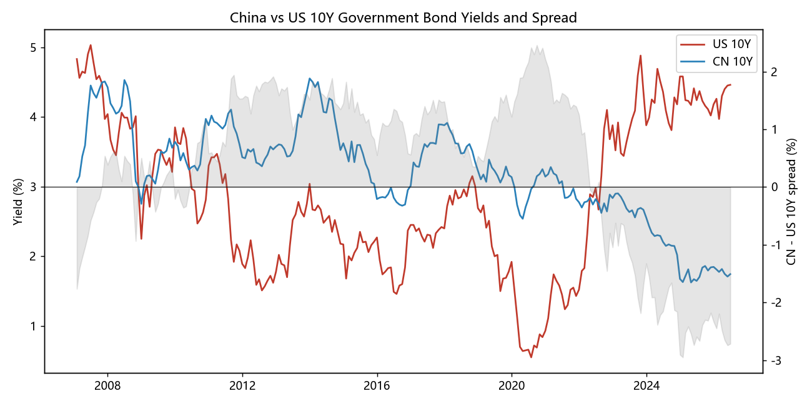
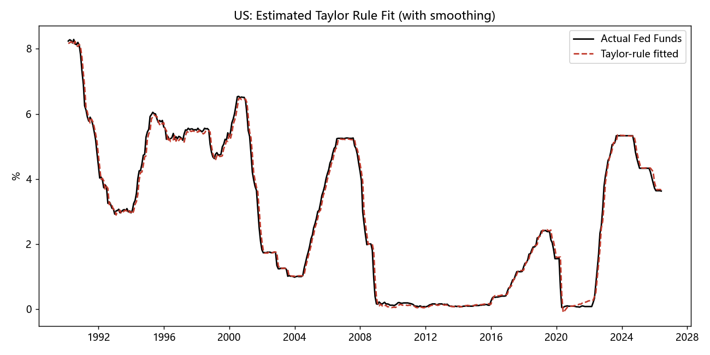

# 中美利率决定机制的差异：量化研究 / China–US Interest-Rate Determination Mechanisms: A Quantitative Study

> 易方达「宏观与大类资产配置赛道」· 题目 5：**中美利率决定机制的差异**
> 从计量经济学角度，对比中美利率的决定机制与驱动因素，并识别其结构性差异。全部实证结果**可一键复现**。

## 一句话结论 / TL;DR

- **美国** = 单锚（2% 通胀）· 强规则（泰勒原则 φ_π≈**1.51**>1）· 快传导（政策→2Y 即期 0.39）· 强全球套利约束。
- **中国** = 多目标 · 弱价格规则（φ_π≈**0.30**<1，R² 0.76 vs 美 0.99）· 价格—数量双轨 · 慢传导（SHIBOR→10Y 即期 **0.03**）· 强自主性（中美 10Y 水平相关 **−0.18**、不协整，利差期末 **−2.72%**）。

## 目录结构 / Layout

```
.
├── report/
│   ├── 中美利率决定机制差异_量化研究报告.md   # 主报告（正文）
│   ├── results.md                            # 计量结果汇总（代码自动生成）
│   └── results.json                          # 机器可读结果
├── code/
│   ├── data_fetch.py    # 抓取美国(FRED)/中国(akshare)数据 → data/*.csv
│   ├── analysis.py      # 泰勒规则/ECM传导/协整/波动 → report/results.* + figures/*
│   └── requirements.txt
├── data/                # 原始与对齐后的月度面板（CSV）
└── figures/             # 图表（PNG）
```

## 复现 / Reproduce

```bash
pip install -r code/requirements.txt
python code/data_fetch.py     # 联网抓取数据（FRED 免 key；akshare 公开接口）
python code/analysis.py       # 计量分析，生成 report/results.* 与 figures/*
```

## 方法概览 / Methods

| 模块 | 方法 | 检验的差异 |
|---|---|---|
| 反应函数 | 含平滑的泰勒规则 OLS + HAC | 政策锚与规则强度 |
| 利率传导 | 两步 Engle–Granger 误差修正模型（ECM）+ 协整 | 传导速度与充分性 |
| 波动结构 | 水平/差分标准差对比 | "哪段利率最稳/最活" |
| 跨国联动 | 相关系数 + 协整检验 | 套利约束与自主性 |

## 数据来源 / Data

- 美国：FRED（FEDFUNDS、DGS2/10、PCEPILFE、UNRATE 等），公共 CSV 端点，无需 API key。
- 中国：akshare（中债国债收益率、SHIBOR、LPR、CPI、GDP，源自中债登/同业拆借中心/统计局）。

## 主要图表 / Figures





## 免责声明 / Disclaimer

本仓库为学术研究与竞赛用途，不构成任何投资建议。数据来自公开来源，口径与样本以代码输出为准。
