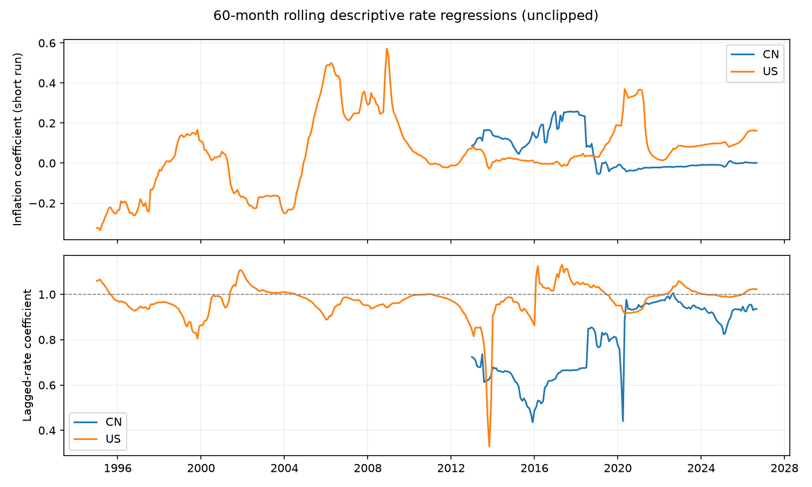

# Quarterly validation / 季度更新与样本敏感性

请求截止 2026-09-30；各字段实际截止见下表。

| country   | column              | last_observation   |
|:----------|:--------------------|:-------------------|
| US        | fed_funds_effective | 2026-09-30         |
| US        | core_pce_yoy        | 2026-08-31         |
| US        | ust_10y             | 2026-09-30         |
| CN        | cn_shibor1w         | 2026-09-30         |
| CN        | cn_cpi_yoy          | 2026-08-31         |
| CN        | cn_10y              | 2026-06-30         |

| country   | sample            | start      | end        |   n |   beta_inflation |    rho |   phi_long_run |   phi_hac_se_delta |   phi_ci_low |   phi_ci_high | long_run_stable   |   r_squared |
|:----------|:------------------|:-----------|:-----------|----:|-----------------:|-------:|---------------:|-------------------:|-------------:|--------------:|:------------------|------------:|
| US        | common_2011       | 2011-01-31 | 2026-08-31 | 188 |           0.0694 | 0.9777 |         3.1161 |             1.0354 |       1.0868 |        5.1454 | False             |      0.9951 |
| US        | common_2017       | 2017-01-31 | 2026-08-31 | 116 |           0.0743 | 0.9809 |         3.8941 |             2.4667 |      -0.9406 |        8.7288 | False             |      0.9924 |
| US        | common_2020       | 2020-01-31 | 2026-08-31 |  80 |           0.1021 | 0.9898 |        10.0216 |            11.7484 |     -13.0052 |       33.0484 | False             |      0.9935 |
| US        | exclude_2020_2021 | 2011-01-31 | 2026-08-31 | 164 |           0.0854 | 0.9672 |         2.6027 |             0.4972 |       1.6282 |        3.5771 | False             |      0.9971 |
| CN        | common_2011       | 2011-01-31 | 2026-08-31 | 188 |           0.0767 | 0.7982 |         0.3802 |             0.1103 |       0.1640 |        0.5965 | True              |      0.7639 |
| CN        | common_2017       | 2017-01-31 | 2026-08-31 | 116 |          -0.0092 | 0.9993 |       -13.6003 |           419.0073 |    -834.8547 |      807.6541 | False             |      0.9607 |
| CN        | common_2020       | 2020-01-31 | 2026-08-31 |  80 |          -0.0091 | 0.9312 |        -0.1326 |             0.1439 |      -0.4147 |        0.1494 | True              |      0.8761 |
| CN        | exclude_2020_2021 | 2011-01-31 | 2026-08-31 | 164 |           0.1073 | 0.7648 |         0.4559 |             0.0808 |       0.2976 |        0.6142 | True              |      0.7623 |

采用原 analysis3.py 的双变量滚动口径：利率 ~ 常数 + 通胀 + 滞后利率。美国为有效联邦基金利率/核心 PCE 同比，中国为 SHIBOR 1 周/CPI 同比；后者是货币市场利率代理，不能当作央行直接政策反应。此表不替代原包含就业/GDP 控制项的多变量结果。两国子样本使用同一组完整月份；滞后在完整月历上生成，删去 2020–2021 年不会把 2019 年错误当作 2022 年的上一月。

标准误为 12 阶 HAC，长期系数为 beta/(1-rho)，区间使用 delta method。接近单位根时该近似可能不可靠：|1-rho|<0.05 或 |rho|>=1 标为不稳定，不能据其点估计判断 Taylor 原则。滚动曲线保留原数值，不再裁剪至固定范围。多次子样本比较为描述性敏感性分析，未经多重检验校正。

最新观测月份与公开发布日不同；本快照不是历史实时信息集。中国国债收益率沿用仓库存量，本轮刷新聚焦反应函数变量，故不能把所有旧图表称为更新至请求日。请求状态与失败后的缓存回退记录在 data/validation_日期/sources.json。

复跑缓存：`python code/quarterly_validation.py --cutoff 2026-09-30`；刷新：追加 `--refresh`。新季度改 cutoff，旧版面板和论文主表保留。
